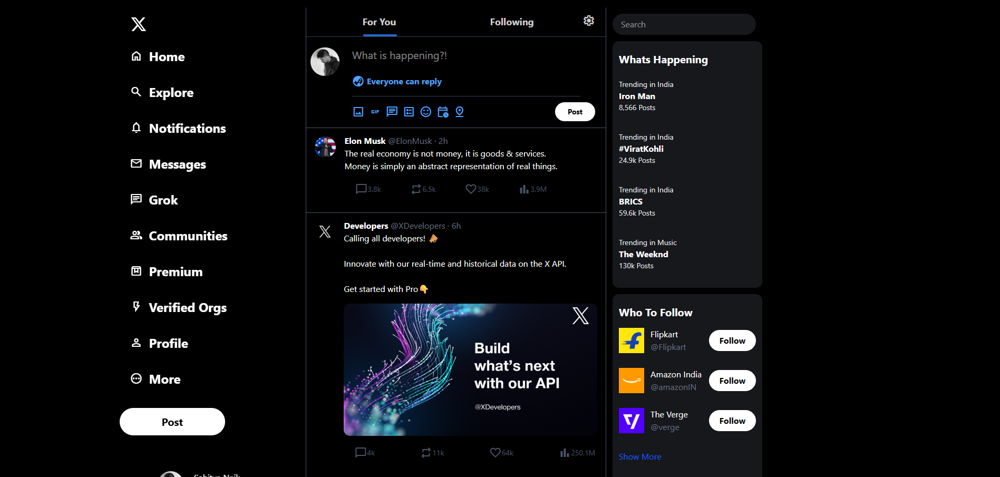

# 🚀 Tailwind CSS Project - x.com (twitter.com)

This is a **responsive web page** built using **Tailwind CSS**. It includes a simple structure with HTML and Tailwind styling.

## 🎨 Technologies Used
- **Tailwind CSS 4.0** - Utility-first CSS framework
- **HTML** - Structure and content
- **Node.js & npm** - Package management  

## 📸 Screenshots

### Desktop View

   

<<<<<<< HEAD
## ✨ Features

### 🎯 Core Features
- **Responsive Design** - Fully responsive layout that works on mobile, tablet, and desktop devices
- **Dark Theme** - Modern dark theme matching X/Twitter's aesthetic
- **Navigation Sidebar** - Complete navigation menu with Home, Explore, Notifications, Messages, and more
- **Tweet Feed** - Main feed displaying posts with engagement metrics (likes, retweets, replies, views)
- **Compose Tweet** - Tweet composition area with media attachment options
- **Trending Topics** - "What's Happening" section showing trending topics
- **Who to Follow** - Suggestions for users to follow
- **User Profile** - Profile card with avatar and username

### 🎨 UI Components
- Material Symbols icons for a modern look
- Hover effects on interactive elements
- Sticky navigation and headers
- Smooth transitions and animations
- Mobile-optimized layout with collapsible sidebar

## 📁 Project Structure

```
X-Twitter-Clone/
│
├── src/
│   ├── index.html          # Main HTML file with the complete UI
│   ├── input.css           # Tailwind CSS import file
│   └── output.css          # Compiled CSS (generated by Tailwind)
│
├── package.json            # Project dependencies and scripts
├── package-lock.json       # Locked dependency versions
├── tailwaind.config.js     # Tailwind CSS configuration
└── README.md               # Project documentation
```

## 🚀 Getting Started / Installation Instructions

### Prerequisites
Make sure you have the following installed on your system:
- **Node.js** (v14 or higher)
- **npm** (comes with Node.js)

### Installation Steps

1. **Clone or download the repository**
   ```bash
   git clone https://github.com/SahityaNaik/X-Twitter-Clone.git   
   cd X-Twitter-Clone
   ```

2. **Install dependencies**
   ```bash
   npm install
   ```
   This will install Tailwind CSS and its CLI tool.

3. **Start the development server**
   ```bash
   npm run dev
   ```
   This command will:
   - Watch for changes in your CSS files
   - Automatically compile Tailwind CSS
   - Generate/update the `output.css` file

4. **Open the application**
   - Open `src/index.html` in your web browser
   - Or use a local development server like Live Server in VS Code

### Development Workflow

- The `npm run dev` command runs Tailwind CSS in watch mode
- Any changes to `input.css` or HTML files will automatically trigger a rebuild
- The compiled CSS is output to `src/output.css`
- Simply refresh your browser to see changes


